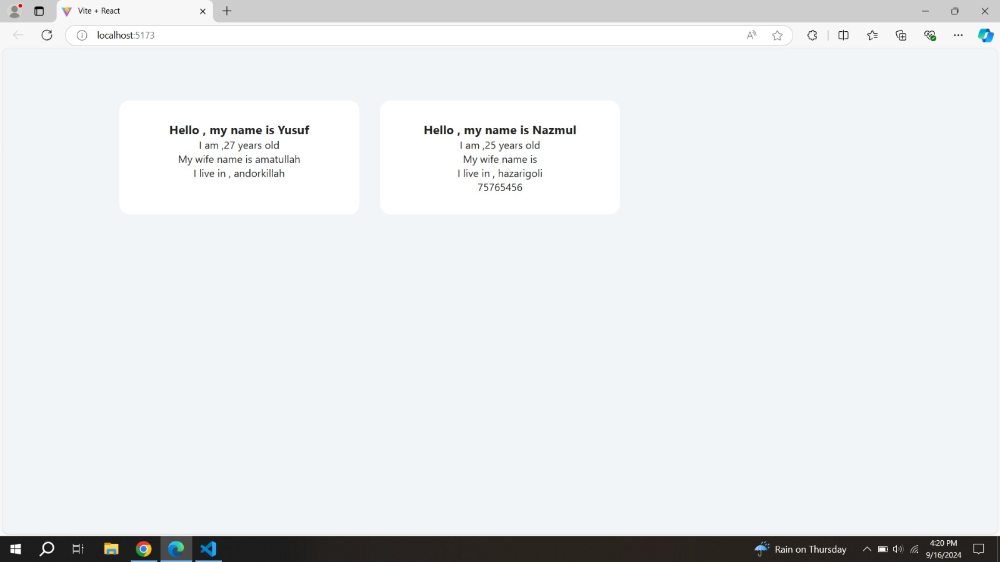
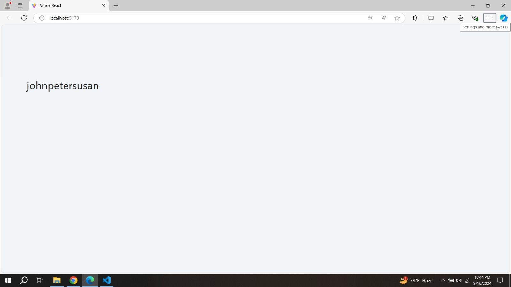
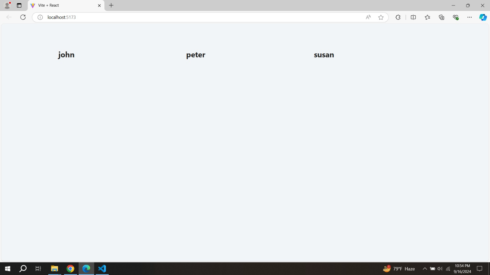

# React Fundamentals

## Table of Contents

- Basics in React
  - Folder Structure
  - First Component
    - Root Component
  - Possible Bug
  - First Component in Detail
  - JSX Rules
  - Nest Components
  - Gloval CSS
  - Local Images (Public Folder)
  - JSX CSS (optional)
  - JSX javascript
- Props ( Initial Setup )

## Basics

#### Folder Structure

- node_modules
  Contains all dependencies required by the app. Main dependencies also listed in package.json

- public
  Contains static assets including index.html (page template)
  - index.html
    - title
    - fonts
    - css
    - favicon
    - id="root" - our entire app
- src
  In simplest form it's the brain of our app. This is where we will do all of our work. src/index.js is the JavaScript entry point.
- .gitignore
  Specifies which files source control (Git) should ignore

- package.json
  Every Node.js project has a package.json and it contains info about our project, for example list of dependencies and scripts

- package-lock.json
  A snapshot of the entire dependency tree

- README
  The markdown file where you can share more info about the project for example build instructions and summary

#### First Component

**First.jsx**

```js
function Show() {
  return (
    <div>
      <Hello />
      <Name />
    </div>
  );
}

//# starting name of component must be upper case
function Hello() {
  return <h1>Hello world</h1>;
}

function Name() {
  return <h4>My name is yusuf</h4>;
}

export default First;
```

**_In component_**

- starts with capital letter
- must return JSX (html)
- always close tag <Greeting/> or <Greeting></Greeting>
- create any component reander thorugh parent component

##### Root Component (only one)

**Main.jsx**

```js
import React from "react";
import ReactDOM from "react-dom/client";

function Greeting() {
  return <h2>My First Component</h2>;
}

const root = ReactDOM.createRoot(document.getElementById("root"));

root.render(<Greeting />);
```

- create a div ---> <div id="root"></div> in **index.html**.
- in main.jsx import "createRoot" function from "react-dom/client". In react it gives us a vartual DOM by createRoot().
- Inside createRoot() function we pass our "div" .
- this function render our all component using jsx.
- Every parent component stand in here . For example --->

```js
createRoot(root).render(
  <StrictMode>
    <Navbar />
    <Header />
    <Main />
    <Footer />
  </StrictMode>
);
```

#### Component in Detail

- capital letter
- must return something
- JSX syntax (return html)
  - to make our lives easier
  - calling function under the hood

**How jsx work :-**

```js
const Greeting = () => {
  return React.createElement("h2", {}, "hello world");
};
```

```js
function Greeting() {
  return (
    <div>
      <h2>hello world</h2>
    </div>
  );
}

const Greeting = () => {
  return React.createElement(
    "div",
    {},
    React.createElement("h2", {}, "hello world")
  );
};
```

#### JSX Rules

- return single element (one parent element)

  - semantics section/article
  - Fragment - let's us group elements without adding extra nodes

```js
return <React.Fragment>...rest of the return</React.Fragment>;

// shorthand

return <>...rest of the return</>;
```

- camelCase property naming convention

**in jsx**

```js
return (
  <div tabIndex={1}>
    <button onClick={myFunction}>click me</button>
    <label htmlFor='name'>Name</label>
    <input readOnly={true} id='name' />
  </div>
);
```

**in HTML**

```html
<div tabindex="1">
  <button onclick="myFunction()">click me</button>
  <label for="name">Name</label>
  <input readonly id="name" />
</div>
```

- className instead of class

```js
return <div className='someValue'>hello</div>;
```

- close every element

```js
return ;
// or
return <input />;
```

- formatting
  - opening tag in the same line as return or ()

```js
function Greeting() {
  return (
    <>
      <div className='someValue'>
        <h3>hello people</h3>
        <ul>
          <li>
            <a href='#'>hello world</a>
          </li>
        </ul>
      </div>
      <h2>hello world</h2>
      <input type='text' name='' id='' />
    </>
  );
}
```

#### Nest Components

_component inside component_

```js
function Greeting() {
  return (
    <div>
      <Person />
      <Message />
    </div>
  );
}

const Person = () => <h2>john doe</h2>;
const Message = () => {
  return <p>this is my message</p>;
};
```

#### Simple Book List (Simple Projects)

- setup structure

**SimpleRender.jsx**:-

```js
function SimpleBookList() {
  return (
    <section>
      <Book />
      <Book />
      <Book />
      <Book />
    </section>
  );
}

const Book = () => {
  return (
    <article className='book'>
      <Image />
      <Title />
      <Author />
    </article>
  );
};

const Image = () => (
  
);
const Title = () => {
  return <h2>Interesting Facts For Curious Minds</h2>;
};
const Author = () => <h4>Jordan Moore </h4>;

export default SimpleBookList;
```

- root.render(<BookList />) --> inside **SimpleBooklist** component we pass **Book** component in four times. So browser gonna show us **Book** component in four time
- Inside **Book** component we create a structure with three components..

#### CSS

- create index.css in src

```css
* {
  margin: 0;
  padding: 0;
  box-sizing: border-box;
}

body {
  font-family: system-ui, -apple-system, BlinkMacSystemFont, "Segoe UI", Roboto,
    Oxygen, Ubuntu, Cantarell, "Open Sans", "Helvetica Neue", sans-serif;
  background: #f1f5f8;
  color: #222;
}
```

- import file and add classes

```js
import "./index.css";

function SimpleBookList() {
  return (
    <section className='booklist'>
      <Book />
      <Book />
      <Book />
      <Book />
    </section>
  );
}

const Book = () => {
  return (
    <article className='book'>
      <Image />
      <Title />
      <Author />
    </article>
  );
};
```

- complete css

```css
.booklist {
  width: 90vw;
  max-width: 1170px;
  margin: 5rem auto;
  display: grid;
  gap: 2rem;
}

@media screen and (min-width: 768px) {
  .booklist {
    grid-template-columns: repeat(3, 1fr);
  }
}
.book {
  background: #fff;
  border-radius: 1rem;
  padding: 2rem;
  text-align: center;
}
.book img {
  width: 100%;
  object-fit: cover;
}
.book h2 {
  margin-top: 1rem;
  font-size: 1rem;
}
```

#### Local Images (Public Folder)

- Optional Video !!!

- external images (hosted on different server) - just need an url
- local images (public folder) - less performant
- local images (src folder) - better solution for assets,
  since under the hood they get optimized.

- save image (Save Image As....)
- create images folder in public
- copy/paste image
- rename (optional)
- replace url in the src - './images/imageName.extension'
- './' because assets are on the same server

```js
const Image = () => (
  
);
```

- whatever assets we place in public - instantly available
- domain(localhost)/asset

#### JSX - CSS (inline styles)

- Basic Idea

- style prop
- {} in JSX means going back to JS Land
- value is an object with key/value pairs - capitalized and with ''

```js
const Author = () => (
  <h4 style={{ color: "#617d98", fontSize: "0.75rem", marginTop: "0.5rem" }}>
    Jordan Moore
  </h4>
);
```

- css rules still apply (inline vs external css)

```css
.book h4 {
  /* won't work */
  color: red;
  /* will work */
  letter-spacing: 2px;
}
```

- external libraries use inline css,
  so if you want to make some changes,
  reference the library docs and elements tab

- alternative option

```js
const Author = () => {
  const inlineHeadingStyles = {
    color: "#617d98",
    fontSize: "0.75rem",
    marginTop: "0.5rem",
  };
  return <h4 style={inlineHeadingStyles}>Jordan Moore </h4>;
};
```

- FOR THE MOST PART, MULTIPLE APPROACHES AVAILABLE !!!
- AS LONG AS THE RESULT IS THE SAME, REALLY COMES DOWN TO PREFERENCE !!!!

#### JSX - Javascript

- refactor to single book component (personal preference)
- remove inline css

```js
const Book = () => {
  return (
    <article className='book'>
      
      <h2>Interesting Facts For Curious Minds</h2>
      <h4>Jordan Moore </h4>
    </article>
  );
};
```

```css
.book h4 {
  color: #617d98;
  font-size: 0.75rem;
  margin-top: 0.5rem;
  letter-spacing: 2px;
}
```

- {} in JSX means going back to JS Land
- value inside must be an expression (return value),
  can't be a statement .
  -for example , `<p>{let x = 6}</p>` its statement and `<p>{6 + 6}</p>` its expression.

**SimpleBookList.jsx** using js in jsx

```js
const author = "Elizabeth Strout";
const title = "Tell Me Everything";
const img =
  "https://images-na.ssl-images-amazon.com/images/I/71XX7KlB7HL._AC_UL254_SR254,254_.jpg";

function SimpleBookList() {
  return (
    <section className='booklist'>
      <Book />
      <Book />
    </section>
  );
}

//? inside curly bracket , must be a expression

const Book = () => {
  return (
    <article className='book'>
      
      <h2>{title}</h2>
      <h4>{author} </h4>
    </article>
  );
};

export default SimpleBookList;
```

- toggle line comment Edit/Toggle Line Comment

### Props

#### Initial Setup (Props)

- When we create the UI structure in a component. Everytime we must need show different different value. Thats value we provide using **Props**
- Every component has its own props.
- In react , when we create a component we must render it .
- When we rendering our component, we pass any **_expression_** through **props** .

create a component :-

```js
const Book = (props) => {
  console.log(props); // --> {} empty object
  return (
    <article className='book'>
      <h2>Name : {props.name}</h2>
      <h4>Author : {props.author}</h4>
    </article>
  );
};
```

- Here we create **Book** component.
- when we render **Book** , we pass the value inside it .

  - for example `<Book name="Trock" author="Yusuf" />`
  - here `name` is key and `Trock` is value.

  ```js
  props = {
    name : "Trock";
    author : "Yusuf";
  }
  ```

- props is a object, convention to call props or any name .

  - inside parameter of Book component we get _props_ .
  - here `props.name === Trock` and `props.author === "Yusuf"`.

- So, pass the value as key/value pairs
- If the prop exists it will return value, otherwise no value.
  **For basic idea**

```js
function Person() {
  // rendering the Book component and pass the Props as key/value pair .
  return (
    <section className='booklist'>
      <Book name='Yusuf' age='27' address='andorkillah' wife='amatullah' />
      <Book name='Nazmul' age='25' address='hazarigoli' num='164575876' />
    </section>
  );
}
const Book = (props) => {
  console.log(props);
  return (
    <article className='book'>
      <h1>Hello , my name is {props.name}</h1>
      <p>I am ,{props.age} years old</p>
      <p>My wife name is {props.wife}</p>
      <p>I live in , {props.address}</p>
      <p>{props.num}</p>
    </article>
  );
};
```

**Result**:-



**_Using Props show the same result_** like **SimpleBookList.jsx** component

**PropsBookList** :-

```js
const author = "Elizabeth Strout";
const title = "Tell Me Everything";
const img =
  "https://images-na.ssl-images-amazon.com/images/I/71XX7KlB7HL._AC_UL254_SR254,254_.jpg";

function PropsBookList() {
  return (
    <section className='booklist'>
      <Book author={author} title={title} img={img} />
      <Book author={author} title={title} img={img} />
    </section>
  );
}
const Book = (props) => {
  console.log(props);
  return (
    <article className='book'>
      
      <h2>{props.title}</h2>
      <h4>{props.author} </h4>
    </article>
  );
};

export default PropsBookList;
```

#### Props - Somewhat Dynamic Setup

- setup an object
- setup props

- _Using props show different two books._
  **PropsBookListTwo.jsx** :

```js
import "./index.css";

//! ================
//? passing different different value using props
//! ================

//* Create two obj
const firstBook = {
  author: "Casey Means",
  title: "Good Energy",
  img: "https://images-na.ssl-images-amazon.com/images/I/71KTwO53SnL._AC_UL600_SR600,400_.jpg",
};
const secondBook = {
  author: "James Clear",
  title: "Atomic Habits",
  img: "https://images-na.ssl-images-amazon.com/images/I/81YkqyaFVEL._AC_UL600_SR600,400_.jpg",
};

function PropsBookListTwo() {
  return (
    <section className='booklist'>
      <Book
        author={firstBook.author}
        title={firstBook.title}
        img={firstBook.img}
      />
      <Book
        author={secondBook.author}
        title={secondBook.title}
        img={secondBook.img}
      />
    </section>
  );
}
const Book = (props) => {
  console.log(props);
  return (
    <article className='book'>
      
      <h2>{props.title}</h2>
      <h4>{props.author} </h4>
    </article>
  );
};

export default PropsBookListTwo;
```

#### Access Props - Multiple Approaches

- we can access the props in various way.

- Destructuring (object)
  [JS Nuggets - Destructuring (object)](https://www.youtube.com/watch?v=i4vhNKihfto&list=PLnHJACx3NwAfRUcuKaYhZ6T5NRIpzgNGJ&index=8&t=1s)

- no need for **props.keyName** in everytime
- destructure **props** inside component.

**first approach**

```js
const Book = (props) => {
  const { img, title, author } = props;
  return (
    <article className='book'>
      
      <h2>{title}</h2>
      <h4>{author} </h4>
    </article>
  );
};
```

- destructure in function parameters (in our case props)
- if you have console.log(props) - it won't be defined

**first approach**

```js
const Book = ({ img, title, author }) => {
  return (
    <article className='book'>
      
      <h2>{title}</h2>
      <h4>{author}</h4>
    </article>
  );
};
```

#### Children Prop (Side Topic)

- everything we render between component tags
- during the course we will mostly use it Context API
- special prop, has to be "children"
- can place anywhere in JSX

```js
function BookList() {
  return (
    <section className='booklist'>
      <Book
        author={firstBook.author}
        title={firstBook.title}
        img={firstBook.img}
      >
        <p>
          Lorem ipsum dolor, sit amet consectetur adipisicing elit. Itaque
          repudiandae inventore eos qui animi sed iusto alias eius ea sapiente.
        </p>
        <button>click me</button>
      </Book>
      <Book
        author={secondBook.author}
        title={secondBook.title}
        img={secondBook.img}
      />
    </section>
  );
}

const Book = ({ img, title, author, children }) => {
  // rest of the logic
};
const Book = (props) => {
  const { img, title, author, children } = props;
  console.log(props);
  return (
    <article className='book'>
      
      <h2>{title}</h2>
      <h4>{author} </h4>
      {children}
    </article>
  );
};
```

- optional CSS

```css
@media screen and (min-width: 768px) {
  .booklist {
    grid-template-columns: repeat(3, 1fr);
    align-items: start;
  }
}
.book p {
  margin: 1rem 0 0.5rem;
}
```

#### Simple List (using Map method)

- using map mehod we also reader the component. As **map** method always return a new array . Its a javascript _expression_ .
- we can render array in _JSX_ .
- [Javascript Nuggets - Map ](https://www.youtube.com/watch?v=80KX6aD9R7M&list=PLnHJACx3NwAfRUcuKaYhZ6T5NRIpzgNGJ&index=1)

**refactor**

```js
//* create  a array of obj
const books = [
  {
  author: "Casey Means",
  title: "Good Energy",
  img: "https://images-na.ssl-images-amazon.com/images/I/71KTwO53SnL._AC_UL600_SR600,400_.jpg",
  },
  {
  author: "James Clear",
  title: "Atomic Habits",
  img: "https://images-na.ssl-images-amazon.com/images/I/81YkqyaFVEL._AC_UL600_SR600,400_.jpg",
  };
];

// pass the obj as value
function BookList() {
  return <section className='booklist'>{books}</section>;
}

const Book = (props) => {
  const { img, title, author } = props;

  return (
    <article className='book'>
      
      <h2>{title}</h2>
      <h4>{author} </h4>
    </article>
  );
};
```

- Its show us nothing .
- we can't render objects in React .

- But we can render the array in _JSX_ .

**For Example :**

```js
const names = ["john", "peter", "susan"];
function NameList() {
  return <section className='booklist'>{names}</section>;
}
```

**in browser we find**


- using **map** method

```js
const names = ["john", "peter", "susan"];
const newNames = names.map((name) => {
  return <h1 key={Math.random()}>{name}</h1>;
});

// newNames = [<h1 key={Math.random()}>john</h1>,<h1 key={Math.random()}>peter</h1>,<h1 key={Math.random()}>susan</h1>]

function BookList() {
  return <section className='booklist'>{newNames}</section>;
}

// or

function BookList() {
  return (
    <section className='booklist'>
      {names.map((name) => {
        return <h1 key={Math.random()}>{name}</h1>;
      })}
    </section>
  );
}
```

- BookList function in different way

  ```js
  function BookList() {
    return (
      <section className='booklist'>
        {[
          <h1 key={Math.random()}>john</h1>,
          <h1 key={Math.random()}>peter</h1>,
          <h1 key={Math.random()}>susan</h1>,
        ]}
      </section>
    );
  }
  ```

- in here array item === 3 , so using map method we get a new array. Inside this array we render this element`<section className='booklist'>{newNames}</section>`. Everytime we render different different data in browser . Because of `{newNames}`

**same thing without map method**

```js
function NameList() {
  // return <section className='booklist'>{newNames}</section>;
  return (
    <section className='booklist'>
      {[<h1>john</h1>, <h1>peter</h1>, <h1>susan</h1>]}
    </section>
  );
}
```

- same result .

**In browser we can see**


#### Proper List

- **Render book item using map method**

**MapPropsBookList.jsx**

```js
const books = [
  {
    author: "Casey Means",
    title: "Good Energy",
    img: "https://images-na.ssl-images-amazon.com/images/I/71KTwO53SnL._AC_UL600_SR600,400_.jpg",
  },
  {
    author: "James Clear",
    title: "Atomic Habits",
    img: "https://images-na.ssl-images-amazon.com/images/I/81YkqyaFVEL._AC_UL600_SR600,400_.jpg",
  },
];
function BookList() {
  return (
    <section className='booklist'>
      {books.map((book) => {
        // destructuring two obj element of book array
        const { img, title, author } = book;
        // indivitualy pass the value of propes
        return <Book img={img} title={title} author={author} />;
      })}
    </section>
  );
  const Book = (props) => {
    return (
      <article className='book'>
        
        <h2>{props.title}</h2>
        <h4>{props.author} </h4>
      </article>
    );
  };
}
```

- In console we get this error `Warning: Each child in a list should have a unique "key"`
- so we need a key prop .

#### Key Prop

- typically it's going to be id .

**using key props when we render the component**

```js
function BookList() {
  return (
    <section className='booklist'>
      {books.map((book) => {
        console.log(book);
        const { img, title, author, id } = book;
        return <Book book={book} key={id} />;
      })}
    </section>
  );
}
```

- in map method we also get the index . We also pass the index as key value.

```js
function BookList() {
  return (
    <section className='booklist'>
      {book.map((book, index) => {
        console.log(book);
        const { img, title, author, id } = book;
        return <Book book={book} key={index} />;
      })}
    </section>
  );
}
```

#### Pass The Entire Obj as props

- render component
- pass entire object
- Destructuring (object)
  [JS Nuggets - Destructuring (object)](https://www.youtube.com/watch?v=i4vhNKihfto&list=PLnHJACx3NwAfRUcuKaYhZ6T5NRIpzgNGJ&index=8&t=1s)

```js
const books = [
  {
    author: "Jordan Moore",
    title: "Interesting Facts For Curious Minds",
    img: "./images/book-1.jpg",
    id: 1,
  },
  {
    author: "James Clear",
    title: "Atomic Habits",
    img: "https://images-na.ssl-images-amazon.com/images/I/81wgcld4wxL._AC_UL900_SR900,600_.jpg",
    id: 2,
  },
];
function BookList() {
  return (
    <section className='booklist'>
      {books.map((book) => {
        // book --> obj, element of books array
        console.log(book);
        return <Book book={book} key={Math.random()} />;
        // here we get two different types of Book component inside array.
      })}
    </section>
  );
}

const Book = (props) => {
  // obj inside array
  const { img, title, author } = props.book;

  return (
    <article className='book'>
      
      <h2>{title}</h2>
      <h4>{author} </h4>
    </article>
  );
};
```

- inside the props we get the intire obj indivitually .

  ```js
  props = {
    book: {
      author: "Jordan Moore",
      title: "Interesting Facts For Curious Minds",
      img: "./images/book-1.jpg",
      id: 1,
    },
  };
  ```

- alternative
  **same thing in but here we destructuring props in params**

```js
const Book = ({ books: { img, title, author } }) => {
  return (
    <article className='book'>
      
      <h2>{title}</h2>
      <h4>{author} </h4>
    </article>
  );
};
```

#### Personal Preference

- utilize spread operator (...) - create a shallow copy of obj and pass this .
- [JS Nuggets - Spread Operator](https://www.youtube.com/watch?v=4Zyr5a3m0Fc&list=PLnHJACx3NwAfRUcuKaYhZ6T5NRIpzgNGJ&index=10)

**Spread Operator**

```js
const friends = ["john", "peter", "anna"];
const newFriends = [...friends, "susan"];
console.log(friends); // ["john", "peter", "anna"]
console.log(newFriends); // ["john", "peter", "anna", "susan"]
const someObject = {
  name: "john",
  job: "developer",
};
// in obj and array , data are pass by referance .
// spread operatior create a copy of array and obj .In different referance .
const newObject = { ...someObject, location: "florida" };
console.log(someObject);
console.log(newObject);
```

**BookList.jsx** :-

```js
const books = [
  {
    author: "Jordan Moore",
    title: "Interesting Facts For Curious Minds",
    img: "./images/book-1.jpg",
    id: 1,
  },
  {
    author: "James Clear",
    title: "Atomic Habits",
    img: "https://images-na.ssl-images-amazon.com/images/I/81wgcld4wxL._AC_UL900_SR900,600_.jpg",
    id: 2,
  },
];
function BookList() {
  return (
    <section className='booklist'>
      {books.map((book) => {
        // passing the copy of obj  using spread operator via propes
        return <Book {...book} key={book.id} />;
      })}
    </section>
  );
}

const Book = (props) => {
  const { img, title, author } = props;
  return (
    <article className='book'>
      
      <h2>{title}</h2>
      <h4>{author} </h4>
    </article>
  );
};

// different approach
const Book = ({ img, title, author }) => {
  // rest of the code
};
```

- inside the props we get the intire copy of book obj .
- using spread operator we unpack the obj and set this inside props.
  Example :-

```js
props = {
  author: "James Clear",
  title: "Atomic Habits",
  img: "https://images-na.ssl-images-amazon.com/images/I/81wgcld4wxL._AC_UL900_SR900,600_.jpg",
  id: 2,
};
```

- if we dont use spread operator and pass the name of obj like :-
- `<Book {book} key={book.id}`

```js
  props = {
  {
  author: "James Clear",
  title: "Atomic Habits",
  img: "https://images-na.ssl-images-amazon.com/images/I/81wgcld4wxL._AC_UL900_SR900,600_.jpg",
  id: 2,
  }
};
```

- here we neve get the value .

#### Events - Fundamentals

- In Vanilla JS

```js
const btn = document.getElementById("btn");

btn.addEventListener("click", function () {
  alert("handle button click");
});
```

- similar approach
- element, event, function
- again camelCase

```js
const EventExamples = () => {
  const handleButtonClick = () => {
    alert("handle button click");
  };
  return (
    <section>
      <button onClick={handleButtonClick}>click me</button>
    </section>
  );
};
```

- [React Events](https://reactjs.org/docs/events.html)
- no need to memorize them(idea is the same)
- most common
  - onClick (click events)
  - onSubmit (submit form )
  - onChange (input change )

```js
function BookList() {
  return (
    <section className='booklist'>
      <EventExamples />
      {books.map((book) => {
        return <Book {...book} key={book.id} />;
      })}
    </section>
  );
}

const EventExamples = () => {
  const handleFormInput = () => {
    console.log("handle form input");
  };
  const handleButtonClick = () => {
    alert("handle button click");
  };
  return (
    <section>
      <form>
        <h2>Typical Form</h2>
        <input
          type='text'
          name='example'
          onChange={handleFormInput}
          style={{ margin: "1rem 0" }}
        />
      </form>
      <button onClick={handleButtonClick}>click me</button>
    </section>
  );
};
```

#### Event Object and Form Submission

```js
const EventExamples = () => {
  const handleFormInput = (e) => {
    console.log(e);
    // e.target - element
    console.log(`Input Name : ${e.target.name}`);
    console.log(`Input Value : ${e.target.value}`);
    // console.log('handle form input');
  };
  const handleButtonClick = () => {
    alert("handle button click");
  };
  const handleFormSubmission = (e) => {
    e.preventDefault();
    console.log("form submitted");
  };
  return (
    <section>
      {/* add onSubmit Event Handler */}
      <form onSubmit={handleFormSubmission}>
        <h2>Typical Form</h2>
        <input
          type='text'
          name='example'
          onChange={handleFormInput}
          style={{ margin: "1rem 0" }}
        />
        {/* add button with type='submit' */}
        <button type='submit'>submit form</button>
      </form>
      <button onClick={handleButtonClick}>click me</button>
    </section>
  );
};
```

- alternative approach

```js
<button type='submit' onClick={handleFormSubmission}>
  submit form
</button>
```

#### Mind Grenade

- alternative approach
- pass anonymous function (in this case arrow function)
- one liner - less code

```js
const EventExamples = () => {
  return (
    <section>
      <button onClick={() => console.log("hello there")}>click me</button>
    </section>
  );
};
```

- also can access event object

```js
const EventExamples = () => {
  return (
    <section>
      <form>
        <h2>Typical Form</h2>
        <input
          type='text'
          name='example'
          onChange={(e) => console.log(e.target.value)}
          style={{ margin: "1rem 0" }}
        />
      </form>
      <button onClick={() => console.log("you clicked me")}>click me</button>
    </section>
  );
};
```

#### Mind Grenade #2

- remove EventsExamples
- components are independent by default

```js
function BookList() {
  return (
    <section className='booklist'>
      {books.map((book) => {
        return <Book {...book} key={book.id} />;
      })}
    </section>
  );
}

const Book = (props) => {
  const { img, title, author } = props;
  const displayTitle = () => {
    console.log(title);
  };

  return (
    <article className='book'>
      
      <h2>{title}</h2>
      <button onClick={displayTitle}>display title</button>
      <h4>{author} </h4>
    </article>
  );
};
```

- remove button

#### Prop Drilling

- react data flow - can only pass props down
- alternatives Context API, redux, other state libraries

```js
function BookList() {
  const someValue = "shakeAndBake";
  const displayValue = () => {
    console.log(someValue);
  };
  return (
    <section className='booklist'>
      {books.map((book) => {
        return <Book {...book} key={book.id} displayValue={displayValue} />;
      })}
    </section>
  );
}

const Book = (props) => {
  const { img, title, author, displayValue } = props;

  return (
    <article className='book'>
      
      <h2>{title}</h2>
      <button onClick={displayValue}>click me</button>
      <h4>{author} </h4>
    </article>
  );
};
```

#### More Complex Example

- initial setup
- create getBook function in booklist
- accepts id as an argument and finds the book
- [Javascript Nuggets - Filter and Find](https://www.youtube.com/watch?v=KeYxsev737s&list=PLnHJACx3NwAfRUcuKaYhZ6T5NRIpzgNGJ&index=4)
- pass the function down to Book Component and invoke on the button click
- in the Book Component destructure id and function
- invoke the function when user clicks the button, pass the id
- the goal : you should see the same book in the console

```js
const BookList = () => {
  const getBook = (id) => {
    const book = books.find((book) => book.id === id);
    console.log(book);
  };

  return (
    <section className='booklist'>
      {books.map((book) => {
        return <Book {...book} key={book.id} getBook={getBook} />;
      })}
    </section>
  );
};

const Book = (props) => {
  const { img, title, author, getBook, id } = props;
  // console.log(props);

  return (
    <article className='book'>
      
      <h2>{title}</h2>
      {/* this is not going to work */}
      <button onClick={getBook(id)}>display title</button>
      <h4>{author}</h4>
    </article>
  );
};
```

- two fixes
- first option - setup wrapper

```js
const Book = (props) => {
  const { img, title, author, getBook, id } = props;
  // console.log(props);
  const getSingleBook = () => {
    getBook(id);
  };
  return (
    <article className='book'>
      
      <h2>{title}</h2>
      <button onClick={getSingleBook}>display title</button>
      <h4>{author}</h4>
    </article>
  );
};
```

- two fixes
- second option - wrap in the anonymous arrow function

```js
const Book = (props) => {
  const { img, title, author, getBook, id } = props;
  // console.log(props);
  const getSingleBook = () => {
    getBook(id);
  };
  return (
    <article className='book'>
      
      <h2>{title}</h2>

      <button onClick={() => getBook(id)}>display title</button>
      <h4>{author}</h4>
    </article>
  );
};
```

#### Import and Export Statements

- remove all getBook code

```js
function BookList() {
  return (
    <section className='booklist'>
      {books.map((book) => {
        return <Book {...book} key={book.id} />;
      })}
    </section>
  );
}

const Book = (props) => {
  const { img, title, author } = props;

  return (
    <article className='book'>
      
      <h2>{title}</h2>

      <h4>{author} </h4>
    </article>
  );
};
```

- setup two files in src books.js and Book.js
- cut books array from index.js
- add to books.js

books.js

```js
const books = [
  {
    author: "Jordan Moore",
    title: "Interesting Facts For Curious Minds",
    img: "./images/book-1.jpg",
    id: 1,
  },
  {
    author: "James Clear",
    title: "Atomic Habits",
    img: "https://images-na.ssl-images-amazon.com/images/I/81wgcld4wxL._AC_UL900_SR900,600_.jpg",
    id: 2,
  },
];
```

- two flavors named and default exports

  - with named exports names MUST match
  - with default exports,can rename but only one per file

- named export

```js
export const books = [
  {
    author: "Jordan Moore",
    title: "Interesting Facts For Curious Minds",
    img: "./images/book-1.jpg",
    id: 1,
  },
  {
    author: "James Clear",
    title: "Atomic Habits",
    img: "https://images-na.ssl-images-amazon.com/images/I/81wgcld4wxL._AC_UL900_SR900,600_.jpg",
    id: 2,
  },
];
```

index.js

```js
import { books } from "./books";
```

- default export

```js
const Book = (props) => {
  const { img, title, author } = props;

  return (
    <article className='book'>
      
      <h2>{title}</h2>

      <h4>{author} </h4>
    </article>
  );
};

export default Book;
```

index.js

```js
import Book from "./Book";
```

#### Local Images (src folder)

- better performance because optimized
- add one more book to array
- download all three images (rename)
- setup images folder in the src
- import all three images in the books.js
- set image property equal to import
- and yes each image requires new import

```js
import img1 from "./images/book-1.jpg";
import img2 from "./images/book-2.jpg";
import img3 from "./images/book-3.jpg";

export const books = [
  {
    author: "Jordan Moore",
    title: "Interesting Facts For Curious Minds",
    img: img1,
    id: 1,
  },
  {
    author: "James Clear",
    title: "Atomic Habits",
    img: img2,
    id: 2,
  },
  {
    author: "Stephen King",
    title: "Fairy Tale",
    img: img3,
    id: 3,
  },
];
```

#### Challenges

- setup numbers
- don't worry about css
- hint - index (second parameter in map)

index.js

```js
const BookList = () => {
  return (
    <section className='booklist'>
      {books.map((book, index) => {
        return <Book {...book} key={book.id} number={index} />;
      })}
    </section>
  );
};

const Book = (props) => {
  const { img, title, author, number } = props;

  return (
    <article className='book'>
      
      <h2>{title}</h2>

      <h4>{author}</h4>
      <span className='number'>{`# ${number + 1}`}</span>
    </article>
  );
};
```

index.css

```css
.book {
  background: #fff;
  border-radius: 1rem;
  padding: 2rem;
  text-align: center;
  /* set relative */
  position: relative;
}

.number {
  position: absolute;
  top: 0;
  left: 0;
  font-size: 1rem;
  padding: 0.75rem;
  border-top-left-radius: 1rem;
  border-bottom-right-radius: 1rem;
  background: #c35600;
  color: #fff;
}
```

#### Add Title

- add a title to our app (css optional)
- change page title

index.js

```js
function BookList() {
  return (
    <>
      <h1>amazon best sellers</h1>
      <section className='booklist'>
        {books.map((book) => {
          return <Book {...book} key={book.id} />;
        })}
      </section>
    </>
  );
}
```

index.css

```css
h1 {
  text-align: center;
  margin-top: 4rem;
  text-transform: capitalize;
}
```

public/index.html

```html
<title>Best Sellers</title>
```

#### Build Production Application

- stop the dev server "ctrl + c"
- run "npm run build"
- build folder gets created

#### Netlify

- sign up
- add new site/deploy manually
- choose build folder
- rename site - site settings/change site name

#### Create-React-App Boilerplate (src)

- index.js

```js
import React from "react";
import ReactDOM from "react-dom/client";

// styles (typically global)
import "./index.css";

// convention to name it App and setup in a separate file
import App from "./App";
// import report web vitals
import reportWebVitals from "./reportWebVitals";

// StrictMode

// StrictMode is a tool for highlighting potential problems in an application.Activates additional checks and warnings for its descendants.Runs only in Development, does not impact the production build. RENDERS TWICE !!! Possible to remove.

const root = ReactDOM.createRoot(document.getElementById("root"));
root.render(
  <React.StrictMode>
    <App />
  </React.StrictMode>
);

// If you want to start measuring performance in your app, pass a function
// to log results (for example: reportWebVitals(console.log))
// or send to an analytics endpoint. Learn more: https://bit.ly/CRA-vitals
reportWebVitals();
```

- remove in src

  - setupTests.js
  - reportWebVitals.js
  - App.test.js

- be careful with multiple css files

App.js

```js
function App() {
  return <h1>backroads app</h1>;
}

export default App;
```

- remove
  - remove logo.svg
  - App.css

#### Vite Docs

(Vite)[https://vitejs.dev/]

#### Vite Install

```sh
npm create vite@latest app-name -- --template react
npm install
npm run dev
```

- http://localhost:5173/

#### Vite Setup

- need to use .jsx extension
- index.html in the source instead of public
- assets still in public
- instead of index.js, need to use main.jsx
- to spin up dev server - "npm run dev"

- rest the same - imports/exports, deployment, assets, etc...
